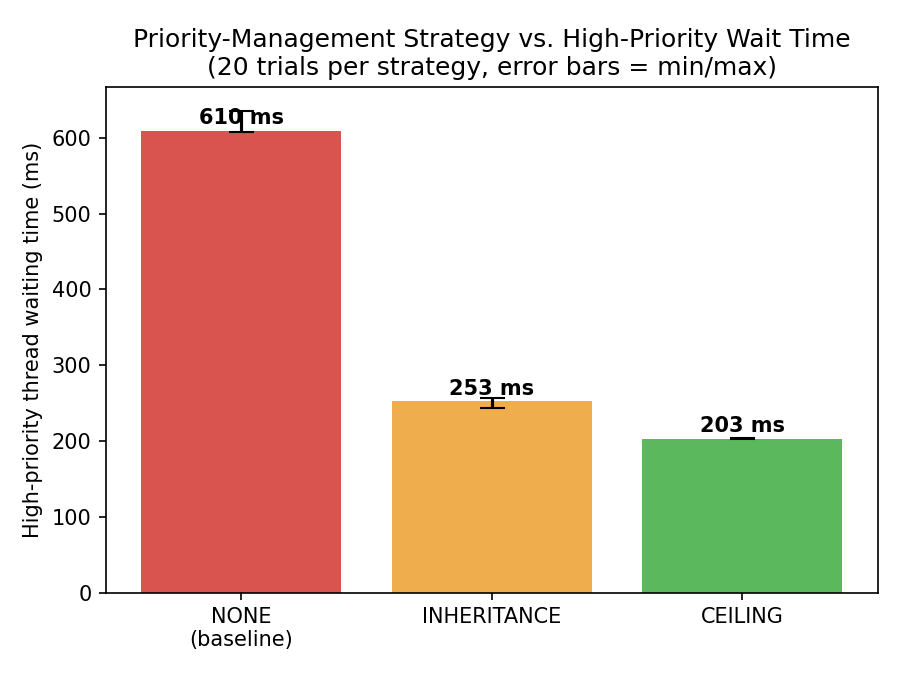

# ECTE331 Project — Robotic Arm Report
## Real-Time Robotic Arm Controller with Priority Management (Tasks 1–6)

**Student:** Ahmed Walid Alaaeldin
**Student ID:** 7684125

---

## 1. System Design

Three real-time threads share one critical resource, `MotorController`:

| Thread | Priority | Function | Class |
|---|---|---|---|
| SafetyMonitor | High | Detects emergencies, stops the arm | `SafetyMonitor.java` |
| MotionPlanner | Medium | Sends movement commands to the motor | `MotionPlanner.java` |
| Logger | Low | Records system activity | `Logger.java` |

For the controlled priority-inversion scenario used in Tasks 3–6, two dedicated
throw-away threads are used instead of MotionPlanner/Logger so that the demonstration is
isolated and repeatable: `LowPriorityTask` (holds the resource) and `MediumPriorityTask`
(does unrelated CPU-bound work and never touches the resource — the classic setup for
demonstrating priority inversion, as in the historical Mars Pathfinder incident).

## 2. Synchronization (Task 2)

Mutual exclusion on `MotorController` is implemented with a `java.util.concurrent.locks.ReentrantLock`.
Only the thread holding the lock can be "in" the critical section (moving/reading the arm
position); `access()` acquires the lock, does the work, and releases it in a `finally`
block so the lock is always released even if an exception occurs.

## 3. Modelling priority inversion deterministically

Java thread priorities (`setPriority`) are only a scheduling *hint* to the JVM/OS — on a
general-purpose (non real-time) operating system there is no guarantee that a
higher-priority thread actually preempts a lower one. To make the demonstration in Task 3
reproducible on any machine (rather than depending on the specific OS scheduler), the
`MotorController` critical section explicitly checks a shared `mediumInterfering` flag: if
the medium-priority task is currently running its unrelated work **and** the resource
holder's own priority has not been raised above medium priority, the critical section is
extended for as long as the interference lasts. Both mitigation protocols raise the
holder's priority above medium priority, so this extension never applies under
`INHERITANCE` or `CEILING` mode — which is exactly the protection those protocols provide.
(Full rationale in the Javadoc of `MotorController.java`.)

## 4. Task 3 — Priority Inversion demonstrated

Scenario: Low acquires the resource and holds it 300 ms → 50 ms later, Medium starts 400 ms
of unrelated CPU work → 50 ms after that, High requests the resource and blocks.

```
[13:26:18.146] LowPriorityTask(Low) acquired resource (waited 0 ms)
[13:26:18.182] MediumPriorityTask(Medium) starting unrelated CPU-bound work (does not use MotorController)
[13:26:18.232] SafetyMonitor(High) requesting emergency stop access to MotorController
[13:26:18.583] MediumPriorityTask(Medium) finished
[13:26:18.859] LowPriorityTask(Low) finished work, arm now at 42
[13:26:18.860] LowPriorityTask(Low) released resource
[13:26:18.860] SafetyMonitor(High) acquired resource (waited 627 ms)
```

The high-priority thread had to wait **627 ms** — far longer than Low's own 300 ms critical
section — because Medium's unrelated execution delayed Low's release. This is priority
inversion: a high-priority task is effectively blocked by a medium-priority task it has no
direct relationship with.

## 5. Task 4 — Priority Inheritance

When `SafetyMonitor` (High) blocks on the resource, it immediately boosts the current
holder's (Low's) priority to its own level:

```
[13:26:19.043] SafetyMonitor(High) is blocked -> inherits priority to LowPriorityTask(Low) (1 -> 10)
[13:26:19.279] LowPriorityTask(Low) finished work, arm now at 42
[13:26:19.280] SafetyMonitor(High) acquired resource (waited 254 ms)
```

Low is no longer starved by Medium once boosted, so it finishes close to its true 300 ms
critical section. High's wait drops from 627 ms to **254 ms**.

## 6. Task 5 — Priority Ceiling

The resource has a ceiling priority (`Thread.MAX_PRIORITY`). The holder is raised to that
ceiling **the instant it acquires the resource**, before anyone else even requests it:

```
[13:26:19.377] LowPriorityTask(Low) acquired resource, raised to ceiling priority 10
[13:26:19.681] LowPriorityTask(Low) released resource
[13:26:19.682] SafetyMonitor(High) acquired resource, raised to ceiling priority 10
```

High's wait drops further to **204 ms** — the best and most consistent result, because
protection is proactive rather than reactive.

## 7. Task 6 — Performance Evaluation

Each strategy was run for **20 trials** (`PerformanceEvaluator`), measuring the
high-priority thread's waiting time every time. Raw data: `performance_results.csv`.

| Strategy | Min (ms) | Avg (ms) | Max (ms) |
|---|---|---|---|
| NONE (baseline) | 607 | 609.6 | 635 |
| Priority Inheritance | 244 | 253.2 | 257 |
| Priority Ceiling | 202 | 203.3 | 204 |



### Discussion

- **Baseline:** ~610 ms average wait — roughly double Low's own 300 ms critical section,
  confirming unbounded priority inversion caused by Medium's interference.
- **Inheritance:** ~253 ms average — close to Low's true 300 ms section (the small gap is
  the 50 ms head-start before High actually requests the resource in this scenario).
  Inheritance works, but only once High has actually started waiting.
- **Ceiling:** ~203 ms average, and the **tightest spread** of all three (only 2 ms between
  min and max) — the most predictable strategy, because the holder is protected from the
  very start of its critical section rather than only after a higher-priority thread blocks.

## 8. Conclusion

Both mitigation protocols eliminate the unbounded priority inversion seen in the baseline.
Priority ceiling gives the lowest average wait and the most predictable (lowest-variance)
response time — exactly the property real-time systems need — because it protects the
resource holder proactively rather than reactively.

## How to reproduce these results

```bash
javac ECTE331RoboticArm/*.java
java -cp . ECTE331RoboticArm.RoboticArmSystem        # Tasks 1-2: basic demo
java -cp . ECTE331RoboticArm.PriorityInversionDemo    # Tasks 3-5: inversion + both protocols
java -cp . ECTE331RoboticArm.PerformanceEvaluator 20  # Task 6: performance evaluation
```
